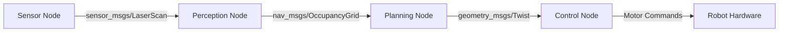

# Technical Documentation Writer

## Purpose

Create technical documentation that serves dual purposes: **teaching concepts** and **providing reference material**. This skill helps:
- Write clear, structured documentation for ROS 2 packages and robotics systems
- Create setup guides and installation instructions
- Document APIs, interfaces, and configuration options
- Develop troubleshooting guides and FAQs
- Build comprehensive README files
- Generate reference documentation from code
- Maintain consistency across documentation

## When to Activate

Use this skill when:
- Creating README files for ROS 2 packages
- Documenting robot system architecture
- Writing API reference documentation
- Creating setup and installation guides
- Developing troubleshooting documentation
- Building user manuals for robotics systems
- Documenting configuration files and parameters
- Creating migration guides or changelogs
- Educators ask about "documentation standards", "technical writing", "API docs"

## Process

### Step 1: Understand Documentation Purpose

When a request comes in for documentation, first clarify:
- **What is being documented?** (Package, system, API, tutorial, guide)
- **Who is the audience?** (Beginners, intermediate users, advanced developers)
- **What is the primary use case?** (Learning, reference, troubleshooting)
- **What level of detail is needed?** (Overview, detailed, comprehensive)
- **What format is required?** (Markdown, reStructuredText, HTML, PDF)
- **What existing documentation exists?** (To maintain consistency)

### Step 2: Choose Documentation Structure

Select appropriate structure based on documentation type:

#### For ROS 2 Packages:
```markdown
# Package Name

## Overview
Brief description of package purpose and capabilities

## Installation
Step-by-step installation instructions

## Quick Start
Minimal example to get started quickly

## Usage
Detailed usage instructions with examples

## API Reference
Nodes, topics, services, parameters documentation

## Configuration
Configuration file structure and options

## Troubleshooting
Common issues and solutions

## Contributing
Guidelines for contributors

## License
License information
```

#### For Tutorials:
```markdown
# Tutorial Title

## Learning Objectives
What you'll learn from this tutorial

## Prerequisites
Required knowledge and setup

## Overview
Conceptual introduction

## Step-by-Step Guide
Detailed instructions with code examples

## Validation
How to verify success

## Troubleshooting
Common issues

## Next Steps
Where to go from here
```

#### For API Documentation:
```markdown
# API Reference

## Overview
API purpose and capabilities

## Authentication
How to authenticate

## Endpoints
Detailed endpoint documentation

## Data Models
Request/response structures

## Error Handling
Error codes and messages

## Rate Limiting
Usage limits and quotas

## Examples
Complete usage examples

## SDKs
Available client libraries
```

### Step 3: Write Clear Descriptions

Follow these principles for clarity:

**Use Active Voice**:
- ✅ "The node publishes velocity commands"
- ❌ "Velocity commands are published by the node"

**Be Specific**:
- ✅ "Set max_velocity to 1.0 m/s for indoor navigation"
- ❌ "Configure velocity appropriately"

**Provide Context**:
- ✅ "This parameter controls maximum linear velocity. Higher values enable faster movement but reduce safety margins."
- ❌ "Maximum velocity parameter."

**Use Consistent Terminology**:
- Pick one term and stick with it (e.g., "node" not "node/component/module")
- Define acronyms on first use
- Maintain glossary for complex terms

### Step 4: Include Code Examples

Every documentation should include runnable code examples:

**Example Structure**:
```markdown
## Example: Basic Usage

This example demonstrates how to create a simple publisher node.

```python
#!/usr/bin/env python3
import rclpy
from rclpy.node import Node
from std_msgs.msg import String

class MinimalPublisher(Node):
    def __init__(self):
        super().__init__('minimal_publisher')
        self.publisher = self.create_publisher(String, 'topic', 10)
        self.timer = self.create_timer(0.5, self.timer_callback)
        self.i = 0

    def timer_callback(self):
        msg = String()
        msg.data = f'Hello World: {self.i}'
        self.publisher.publish(msg)
        self.get_logger().info(f'Publishing: "{msg.data}"')
        self.i += 1

def main(args=None):
    rclpy.init(args=args)
    node = MinimalPublisher()
    rclpy.spin(node)
    node.destroy_node()
    rclpy.shutdown()

if __name__ == '__main__':
    main()
```

**Running the example**:
```bash
ros2 run my_package minimal_publisher
```

**Expected output**:
```
[INFO] [minimal_publisher]: Publishing: "Hello World: 0"
[INFO] [minimal_publisher]: Publishing: "Hello World: 1"
...
```
```

**Code Example Checklist**:
- [ ] Code is complete and runnable
- [ ] Includes necessary imports
- [ ] Shows expected output
- [ ] Explains key concepts
- [ ] Provides context for usage

### Step 5: Document Parameters and Configuration

Create comprehensive parameter documentation:

**Parameter Documentation Template**:
```markdown
## Parameters

### `max_velocity`
- **Type**: `double`
- **Default**: `1.0`
- **Unit**: `m/s`
- **Range**: `[0.1, 5.0]`
- **Description**: Maximum linear velocity for robot movement. Higher values enable faster navigation but reduce safety margins. For indoor environments, values between 0.5-1.5 m/s are recommended.
- **Example**:
  ```yaml
  controller:
    max_velocity: 0.8
  ```

### `control_frequency`
- **Type**: `double`
- **Default**: `50.0`
- **Unit**: `Hz`
- **Range**: `[10.0, 100.0]`
- **Description**: Control loop update frequency. Higher frequencies provide smoother control but increase CPU usage. 50 Hz is suitable for most mobile robots.
- **Example**:
  ```yaml
  controller:
    control_frequency: 50.0
  ```
```

### Step 6: Create Troubleshooting Guides

Anticipate common issues and provide solutions:

**Troubleshooting Template**:
```markdown
## Troubleshooting

### Issue: Node fails to start

**Symptoms**:
- Error message: "Failed to create node"
- Node immediately exits

**Possible Causes**:
1. ROS 2 environment not sourced
2. Package not built
3. Missing dependencies

**Solutions**:
1. Source ROS 2 environment:
   ```bash
   source /opt/ros/humble/setup.bash
   ```

2. Build the package:
   ```bash
   colcon build --packages-select my_package
   source install/setup.bash
   ```

3. Install dependencies:
   ```bash
   rosdep install --from-paths src --ignore-src -r -y
   ```

### Issue: No messages on topic

**Symptoms**:
- `ros2 topic echo` shows no output
- Subscriber not receiving messages

**Possible Causes**:
1. Publisher not running
2. Topic name mismatch
3. QoS incompatibility

**Solutions**:
1. Verify publisher is running:
   ```bash
   ros2 node list
   ros2 topic list
   ```

2. Check topic name:
   ```bash
   ros2 topic info /topic_name
   ```

3. Check QoS settings:
   ```bash
   ros2 topic info /topic_name --verbose
   ```
```

### Step 7: Add Diagrams and Visualizations

Include visual aids where helpful:

**When to Use Diagrams**:
- System architecture
- Data flow
- State machines
- Network topology
- Component relationships

**Diagram Types**:
- **Architecture diagrams**: Show system components and connections
- **Sequence diagrams**: Show message flow over time
- **State diagrams**: Show state transitions
- **Data flow diagrams**: Show data transformation pipeline

**Diagram Tools**:
- Mermaid (for inline diagrams in Markdown)
- Draw.io / diagrams.net
- PlantUML
- Graphviz

**Example Mermaid Diagram**:
```markdown
## System Architecture


```

### Step 8: Maintain Consistency

Ensure documentation follows consistent patterns:

**Style Guidelines**:
- Use present tense ("The node publishes" not "The node will publish")
- Use second person for instructions ("You can configure" not "One can configure")
- Use imperative for commands ("Run the node" not "You should run the node")
- Capitalize proper nouns (ROS 2, Gazebo, Ubuntu)
- Use code formatting for: commands, file names, variable names, code snippets

**Formatting Standards**:
- Headings: Use sentence case ("Getting started" not "Getting Started")
- Lists: Use parallel structure
- Code blocks: Always specify language
- Links: Use descriptive text, not "click here"
- File paths: Use forward slashes, even on Windows

### Step 9: Review and Validate

Before finalizing documentation:

**Documentation Quality Checklist**:
- [ ] All code examples are tested and work
- [ ] Installation instructions are complete
- [ ] Prerequisites are clearly stated
- [ ] Parameters are fully documented
- [ ] Common issues have troubleshooting guides
- [ ] Diagrams are clear and accurate
- [ ] Links are valid and working
- [ ] Spelling and grammar are correct
- [ ] Formatting is consistent
- [ ] No placeholder text remains

**Validation Methods**:
1. **Fresh Install Test**: Follow documentation on clean system
2. **Peer Review**: Have someone else review for clarity
3. **Link Checker**: Verify all links work
4. **Code Testing**: Run all code examples
5. **Spell Check**: Use automated tools

### Step 10: Maintain and Update

Keep documentation current:

**Maintenance Practices**:
- Update documentation with code changes
- Add new troubleshooting items as issues arise
- Incorporate user feedback
- Review documentation quarterly
- Archive outdated information
- Maintain changelog

**Changelog Template**:
```markdown
## Changelog

### [1.2.0] - 2024-12-03
#### Added
- New parameter for obstacle avoidance
- Support for ROS 2 Humble

#### Changed
- Updated installation instructions
- Improved error handling documentation

#### Fixed
- Corrected parameter default values
- Fixed broken links in API reference

#### Deprecated
- Old configuration format (use YAML instead)
```

## Output Format

Present documentation following appropriate template:

### For ROS 2 Package README:
```markdown
# Package Name

[](https://docs.ros.org/en/humble/)
[](LICENSE)

Brief one-line description of the package.

## Overview

Detailed description of what the package does, its purpose, and key features.

## Installation

### Prerequisites
- ROS 2 Humble
- Ubuntu 22.04
- Additional dependencies

### Building from Source
```bash
cd ~/ros2_ws/src
git clone https://github.com/user/package.git
cd ~/ros2_ws
rosdep install --from-paths src --ignore-src -r -y
colcon build --packages-select package_name
source install/setup.bash
```

## Quick Start

```bash
ros2 launch package_name demo.launch.py
```

## Usage

### Running the Node
```bash
ros2 run package_name node_name
```

### Configuration
Edit `config/params.yaml`:
```yaml
node_name:
  parameter: value
```

## API Reference

### Nodes

#### `node_name`
Main processing node.

**Subscribed Topics**:
- `/input` (`sensor_msgs/LaserScan`): Input sensor data

**Published Topics**:
- `/output` (`nav_msgs/OccupancyGrid`): Processed output

**Parameters**:
- `param_name` (double, default: 1.0): Parameter description

**Services**:
- `~/reset` (`std_srvs/Empty`): Reset node state

## Examples

See `examples/` directory for complete examples.

## Troubleshooting

See [TROUBLESHOOTING.md](TROUBLESHOOTING.md) for common issues and solutions.

## Contributing

Contributions are welcome! Please read [CONTRIBUTING.md](CONTRIBUTING.md).

## License

This project is licensed under the MIT License - see [LICENSE](LICENSE) file.

## Acknowledgments

- List contributors
- Reference related projects
```

## Common Patterns

### Pattern 1: Quick Reference Card

For experienced users who need quick lookup:

```markdown
# Quick Reference

## Common Commands
```bash
# Start node
ros2 run package node

# Launch system
ros2 launch package launch_file.py

# Check status
ros2 node info /node_name
```

## Key Parameters
| Parameter | Type | Default | Description |
|-----------|------|---------|-------------|
| max_vel | double | 1.0 | Max velocity (m/s) |
| rate | int | 50 | Update rate (Hz) |

## Topic Interface
| Topic | Type | Direction |
|-------|------|-----------|
| /cmd_vel | Twist | Subscribe |
| /odom | Odometry | Publish |
```

### Pattern 2: Tutorial-Style Documentation

For learners who need step-by-step guidance:

```markdown
# Tutorial: Building Your First Robot Controller

## What You'll Learn
- How to create a ROS 2 node
- How to subscribe to sensor data
- How to publish control commands

## Prerequisites
- ROS 2 Humble installed
- Basic Python knowledge
- Completed "ROS 2 Basics" tutorial

## Step 1: Create Package
First, create a new ROS 2 package...

[Detailed step-by-step instructions with explanations]
```

### Pattern 3: API Reference

For developers integrating with your system:

```markdown
# API Reference

## Class: RobotController

### Constructor
```python
RobotController(max_velocity: float = 1.0, control_rate: int = 50)
```

**Parameters**:
- `max_velocity`: Maximum velocity in m/s
- `control_rate`: Control loop frequency in Hz

**Raises**:
- `ValueError`: If parameters are out of valid range

### Methods

#### `set_target(x: float, y: float) -> None`
Set target position for robot.

**Parameters**:
- `x`: Target x coordinate in meters
- `y`: Target y coordinate in meters

**Example**:
```python
controller = RobotController()
controller.set_target(5.0, 3.0)
```
```

## Troubleshooting

### Documentation is Too Long

**Problem**: Documentation becomes overwhelming

**Solutions**:
1. Split into multiple files (README, API, TROUBLESHOOTING)
2. Use table of contents for navigation
3. Provide "Quick Start" section
4. Link to detailed sections instead of inline detail
5. Create separate beginner/advanced guides

### Examples Don't Work

**Problem**: Code examples fail when users try them

**Solutions**:
1. Test all examples on clean system
2. Include complete code, not snippets
3. Specify exact versions of dependencies
4. Provide expected output
5. Add troubleshooting for common issues

### Documentation Gets Outdated

**Problem**: Documentation doesn't match current code

**Solutions**:
1. Update docs with every code change
2. Use automated documentation generation where possible
3. Include version numbers in documentation
4. Review documentation regularly
5. Mark deprecated features clearly

## Integration with Other Skills

This skill works well with:

**→ robotics-content-creator**: Use for creating educational content with proper documentation
**→ practical-exercise-builder**: Document exercises with clear instructions
**→ deployment-assistant**: Create deployment documentation and guides

## Tips for Success

1. **Start with Outline**: Plan structure before writing
2. **Test Everything**: All code examples must work
3. **Use Templates**: Maintain consistency across documentation
4. **Get Feedback**: Have others review for clarity
5. **Keep It Current**: Update with code changes
6. **Be Specific**: Provide exact commands and values
7. **Show Examples**: Every concept needs an example
8. **Anticipate Questions**: Address common issues proactively
9. **Use Visuals**: Diagrams clarify complex concepts
10. **Maintain Style**: Follow consistent formatting and terminology

---

**Ready to create documentation?** Provide:
- What needs to be documented
- Target audience level
- Primary use case (learning/reference/troubleshooting)
- Existing documentation to maintain consistency with
- Specific requirements or constraints
